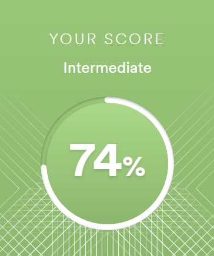

**Mikhail Smirnov**

---


**Location:** Kusadasi/Turkey

**Phone:** +905340311519

**Telegram:** @honeyface

---

**About myself:** I have been interested technology and programming very long time, but everytime something or someone didnt allow me to try this. Now im a mediabuyer, who works with mobile app advertising. I started to learn HTML/CSS/JS and three months ago i think this is my part of life.

---

**Skills:**

-   HTML (Basic)
-   CSS (Basic)
-   JavaScript (Basic)
-   Git, GitHub
-   VScode

---

**Solution example:**

```
function derive(coefficient,exponent) {
    if (coefficient !== 0 && exponent !== 0 && exponent !== 1) {
        return `${coefficient * exponent}x^${exponent - 1}`;
    } else {
        return 'Error';
    }
}
```

---

**Courses:**

-   Udemy
    -   Web-developer (Complete 100%)
    -   JavaScript + React (Complete 30%)

All courses are recorded by Ivan Petrichenko

---

**Language level:**


English - Intermediate
Russian - Native
Turkish - Begginer
